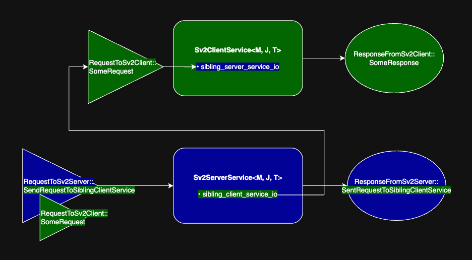
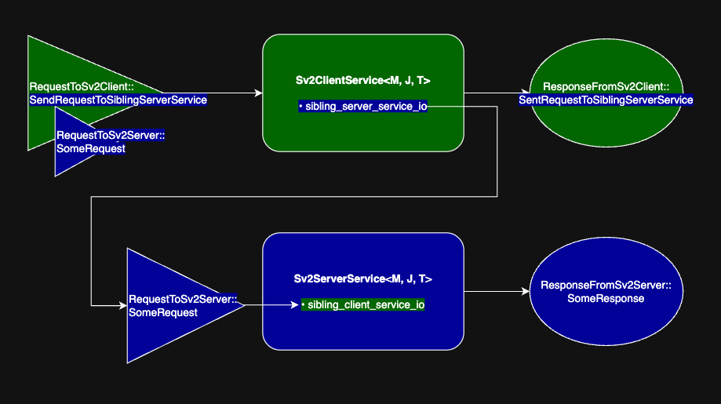

<h1 align="center">
  <br>
  
  <br>
tower-stratum
<br>
</h1>

<p align="center">
  <a href="https://codecov.io/gh/plebhash/tower-stratum" > 
     
  </a>
</p>
<p align="center">
🦀 Tower middleware for Bitcoin mining over <a href="https://github.com/stratum-mining/stratum">Stratum V2 Reference Implementation</a> ⛏️
</p>

This crate aims to provide a robust middleware API for building Bitcoin mining apps based on:
- [Tower](https://docs.rs/tower/latest/tower/): an asynchronous middleware framework for Rust
- [Tokio](https://tokio.rs/): an asynchronous runtime for Rust
- [Stratum V2 Reference Implementation](https://github.com/stratum-mining/stratum): the reference implementation of the Stratum V2 protocol

The goal is to provide a "batteries-included" approach to implement stateful Sv2 applications.

Note: currently development focus is on Stratum V2 (Sv2). While theoretically possible, Sv1 integration is not planned for the near future.

# Scope

`tower-stratum` provides [`tower::Service`](https://docs.rs/tower/latest/tower/trait.Service.html)s for building apps to be executed under `tokio` runtimes.

They can be divided in two categories:
- Client-side (`Sv2ClientService`)
- Server-side (`Sv2ServerService`)

The user is expected to implement handlers for the different Sv2 subprotocols, and use simple high-level APIs to compose Sv2 applications that are able to exchange Sv2 messages and behave according to the handler.

## Client-side


`Sv2ClientService<M, J, T>` is a `tower::Service` representing a Sv2 Client.

It's able to establish a TCP connection with the Server and exchange `SetupConnection` messages to negotiate the Sv2 Connection parameters according to the user configurations.

Noise encryption over the TCP connections is optional.

It listens for messages from the server, generating `type Request = RequestToSv2Client` for a `Service::call`, which triggers execution of the different subprotocol handlers (implemented by the user) and returns some `type Response = ResponseFromSv2Client`.

The user is expected to set the different generic parameters `<M, J, T>` with implementations for the handler traits of the different subprotocols:
- `M` must implement `trait Sv2MiningClientHandler`
  - example use-cases:
    - Sv2 CPU miner
    - Sv2 Proxy
- `J` must implement `trait Sv2JobDeclarationClientHandler`
  - example use-cases:
    - Sv2 Job Declarator Client
- `T` must implement `trait Sv2TemplateDistributionClientHandler`
  - example use-cases:
    - Sv2 Pool
    - Sv2 Job Declarator Client
    - Sv2 Solo Mining Server

For the subprotocols that are not supported, Null handler implementations are provided:
- `NullSv2MiningClientHandler`
- `NullSv2JobDeclarationClientHandler`
- `NullSv2TemplateDistributionClientHandler`

Whenever `Sv2ClientService<M, J, T>` is loaded with one of these Null handler implementations, the service will NOT support such subprotocol.

## Server-side


`Sv2ServerService<M, J, T>` is a `tower::Service` representing a Sv2 Server.

It's able to listen for TCP connections and exchange `SetupConnection` messages to negotiate the Sv2 Connection parameters according to the user configurations.

Noise encryption over the TCP connections is optional.

It listens for messages from multiple clients, generating `type Request = RequestToSv2Server` for a `Service::call`, which triggers execution of the different subprotocol handlers (implemented by the user) and returns some `type Response = ResponseFromSv2Server`.

Inactive clients have their connections killed and are removed from memory after some predefined time.

The user is expected to set the different generic parameters `<M, J, T>` with implementations for the handler traits of the different subprotocols:
- `M` must implement `trait Sv2MiningServerHandler`
  - example use-cases:
    - Sv2 Proxy
    - Sv2 Pool
    - Sv2 Solo Mining Server
- `J` must implement `trait Sv2JobDeclarationServerHandler`
  - example use-cases:
    - Sv2 Job Declarator Server
- `T` must implement `trait Sv2TemplateDistributionServerHandler`
  - example use-cases:
    - Sv2 Template Provider


For the subprotocols that are not supported, Null handler implementations are provided:
- `NullSv2MiningServerHandler`
- `NullSv2JobDeclarationServerHandler`
- `NullSv2TemplateDistributionServerHandler`

Whenever `Sv2ServiceService<M, J, T>` is loaded with one of these Null handler implementations, the service will NOT support such subprotocol.

## Inter-Service Communication

`tower-stratum` supports inter-service communication between a `Sv2ServerService` and a `Sv2ClientService` pair through the sibling IO mechanism. This allows for building complex Sv2 applications that require bidirectional communication between a server and client service running **within the same application**.

`tower-stratum` services are called "siblings" when they are tightly coupled with a server/client counterpart **within the same application**. This distinction is very important, and should not be confused with server/client communication across the wire, where server and client are actually different applications.

The notion of sibling services allows for different use-cases, such as:
- Mining Server + Mining Client (e.g.: Proxy)
- Mining Server + Template Distribution Client (e.g.: Pool, [`pleblottery`](https://github.com/vinteumorg/pleblottery))
- Mining Server + Job Declaration Client + Template Distribution Client (e.g.: JDC)
- Job Declaration Server + Template Distribution Client (e.g.: JDS)

### Sibling Service creation

`Sv2ServerService::new_with_sibling` constructor also returns a `Sv2SiblingServerServiceIo`, which can be fed into constructor `Sv2ClientService::new_from_sibling_io`:

```rust
// Create a server along with a sibling_io
//               v
let (server, sibling_io) = Sv2ServerService::new_with_sibling_io(
    server_config,
    server_m_handler,
    server_jd_handler,
    server_td_handler,
)?;

// Create a client service using the sibling_io
let client = Sv2ClientService::new_from_sibling_io(
    client_config,
    client_m_handler,
    client_jd_handler,
    client_td_handler,
    sibling_io, // <- use sibling_io to construct client service
)?;
```

### Communication Between Siblings

Services can communicate with their siblings by sending requests via the sibling IO channels, which are triggered with special request variants.

For example, here's an illustration of a `Sv2ServerService` receiving a `RequestToSv2Server::SendRequestToSiblingClientService`, which results in `Sv2ClientService` receiving some specific `RequestToSv2Client`.

Please note that these two sibling services belong to the same application.

```rust
// Server sending request to its sibling client
let response = server.call(RequestToSv2Server::SendRequestToSiblingClientService(
    RequestToSv2Client::SomeRequest(...),
)).await?;
```



Alternatively, here's an illustration of a `Sv2ClientService` receiving a `RequestToSv2Client::SendRequestToSiblingServerService`, which results in `Sv2ServerService` receiving some specific `RequestToSv2Server`.

Please note that these two sibling services belong to the same application.

```rust
// Client sending request to its sibling server
let response = client.call(RequestToSv2Client::SendRequestToSiblingServerService(
    RequestToSv2Server::SomeRequest(...),
)).await?;
```



# License

[`MIT`](LICENSE)